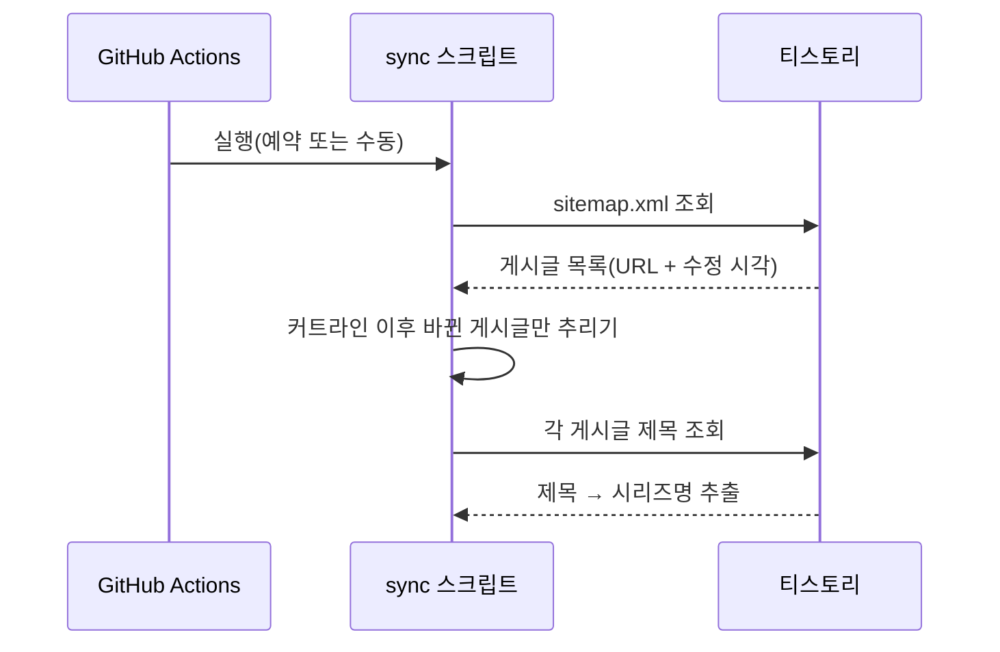
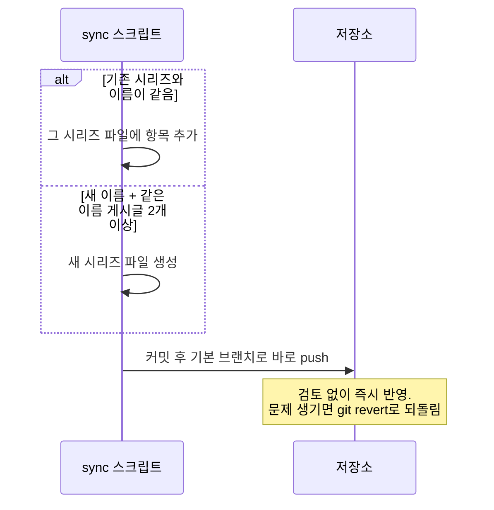

# Feature Specification: 티스토리 시리즈 목차 JSON 동기화 자동화

**Feature Branch**: `001-tistory-series-sync`

**Created**: 2026-07-21

**Status**: Draft

**Input**: User description: "slug 중 \"blog-sitemap-sync\"의 decide.md를 handoff 하여 진행 — kenel.tistory.com/sitemap.xml에서 lastmod가 마지막 동기화 시점 이후로 갱신된 게시글만 골라내어, 기존 `*_series.json` 시리즈 목차 파일을 GitHub Actions로 자동 갱신한다."

## 배경: 게시글 제목 구조와 용어

이 문서 전반에서 반복해서 등장하는 용어는 모두 티스토리 게시글 제목의 구조에서 비롯된다.
아래는 실제 게시글 제목 예시다.

```
[Kotlin] Coroutines - 기초
```

이 제목은 아래와 같이 나뉜다.

| 부분 | 이 예시에서의 값 | 설명 |
|------|-----------|------|
| 부가 태그 | `[Kotlin]` | 대괄호로 감싸인 구간. 시리즈명을 추출할 때 제거된다 |
| **원시 시리즈명** | `Coroutines` | 제목에서 마지막 `" - "` 앞부분을 취한 뒤, 그 안의 대괄호 구간을 제거하고 좌우 공백을 정리해 남은 부분. 사람이 읽는 시리즈 이름 그대로다 |
| 구분자 | `-` | 원시 시리즈명과 부제목을 나누는, 제목에서 **마지막으로 등장하는** `" - "` |
| 부제목 | `기초` | 마지막 `" - "` 뒤에 오는 부분. 개별 게시글을 구분하는 값이며, 이번 기능에서는 사용하지 않는다 |

원시 시리즈명으로부터 이 스펙 전반에서 쓰이는 두 값이 파생된다.

- **seriesId**: 원시 시리즈명을 소문자로 바꾸고, 공백과 파일명에 쓸 수 없는 문자를 제거해 만든 값(이 예시에서는 `coroutines`). 시리즈 파일명(`<seriesId>_series.json`)을 정하고 기존 시리즈와 매칭할 때만 쓰이며, 화면이나 json에 그대로 노출되지 않는다.
- **listName**: 시리즈 파일(`*_series.json`)에 저장되는, 사람이 읽는 이름. seriesId로 정규화하기 전의 원시 시리즈명을 그대로 쓴다(이 예시에서는 `Coroutines`).

즉 하나의 게시글 제목에서 원시 시리즈명이 한 번 추출되면, 그 값이 정규화되어 **seriesId**(파일 매칭용)로 한 번, 그대로 **listName**(화면 표시용)으로 한 번, 이렇게 두 갈래로 쓰인다.

## Clarifications

### Session 2026-07-21

- Q: 자동화가 다루는 모든 시각 계산은 어떤 시간대를 기준으로 해야 하는가? → A: GitHub Actions 실행 환경의 기본 시각대와 무관하게 한국 표준시(KST, UTC+9)로 고정한다.
- Q: `lastmod`와 비교할 "커트라인" 시각을 언제로 잡아야 하는가? → A: 실행이 시작된 순간이 아니라, 실행 시작 시각에서 5분을 뺀 시각을 커트라인으로 사용해 안전 마진을 둔다.
- Q: 게시글 제목에서 시리즈명을 추출하는 규칙은 무엇인가(기존 "listName이 제목에 포함되는지" 방식 대신)? → A: 제목에서 마지막으로 등장하는 `" - "` 앞부분을 취하고, 대괄호로 감싸인 구간을 전부 제거한 뒤 좌우 공백을 정리해 원시 시리즈명으로 삼는다. 이는 이 저장소에서 게시글 페이지가 시리즈 json을 스스로 찾아올 때 이미 쓰고 있는 방식과 동일하게 맞춘 것이다. `" - "`가 없는 제목은 시리즈 추출 대상에서 제외한다.
- Q: 매칭·파일명 결정에 쓰이는 정규화된 값과, 사람이 읽는 `listName` 값은 어떤 관계인가? → A: 원시 시리즈명(예: "Coroutines")을 소문자 변환·공백 제거·파일명 금지 문자 제거해 만든 값을 "seriesId"라 부르며, 이는 매칭과 파일명 결정에만 쓰인다. json의 `listName`은 여전히 사람이 읽는 원시 시리즈명 그대로 저장된다.
- Q: 이미 시리즈 파일에 존재하는 게시글을 다시 만나면 어떻게 하는가? → A: 그 게시글 URL이 이미 `items`에 있으면 건너뛰고, 없으면 배열 끝에 추가한다. 기존 항목의 순서는 건드리지 않는다(관리자가 직접 재배치할 수 있어야 하므로).
- Q: 새로운 seriesId를 발견하면 항상 새 파일을 만들어야 하는가? → A: 아니다. 같은 seriesId를 공유하며 현재 sitemap에 존재하는(공개된) 게시글이 2개 이상일 때만 새 파일을 생성한다. 1개뿐이면 생성하지 않는다.
- Q: 게시글 제목이 바뀌는 경우(같은 seriesId를 유지하며 부제만 바뀌거나, 다른 seriesId로 바뀌는 경우)는 이번 기능에서 다루는가? → A: 아니다. 이번 기능 범위 밖이며 별도 기능으로 다룬다.
- Q: 게시글이 삭제되거나 비공개로 전환되어 sitemap에서 사라지는 경우는 이번 기능에서 다루는가? → A: 아니다. 이번 기능 범위 밖이며 별도 기능으로 다룬다.
- Q: 동기화 상태는 커트라인 시각만 기록하면 되는가? → A: 아니다. 지금까지 처리한 모든 게시글 각각의 URL, 원시 시리즈명, 마지막 처리 시각까지 함께 기록해, 새 시리즈 생성 임계치 판단의 근거로 삼고 향후 제목 변경·삭제 처리 기능의 기반으로도 남겨둔다.
- Q: '원시 시리즈명'·'seriesId' 같은 용어를 처음 읽는 사람도 이해할 수 있도록 게시글 제목 형식과 용어를 어디에 정리해야 하는가(spec.md 내부 vs 별도 문서)? → A: 별도 문서를 만들지 않고, spec.md 상단(Input 바로 다음)에 "배경: 게시글 제목 구조와 용어" 섹션을 추가해 정리한다. 이 용어들은 이 스펙의 FR-008·FR-009·Key Entities를 읽는 데 필수적인 배경이라 같은 문서 안에 있어야 참조가 끊기지 않는다.

### Session 2026-07-22

- Q: 자동화가 만든 변경 사항을 Pull Request로 제안해 사람이 병합하기 전까지 검토하게 할 것인가, 아니면 기본 브랜치로 바로 커밋·푸시할 것인가? → A: 바로 커밋·푸시한다. PR 검토는 관리자에게 반복적인 수동 확인 부담을 주며, 잘못된 변경이 반영되더라도 `git revert`로 되돌릴 수 있으므로 병합 전 검토 단계를 두지 않는다. 이에 따라 "병합 전 검토를 통한 안전장치"를 다루던 User Story 3은 더 이상 유효하지 않아 제거한다.

## 전체 흐름 개요

한 번의 동기화 실행은 크게 두 단계로 나뉜다: **① 무엇이 바뀌었는지 모으는 단계**와
**② 모은 정보로 무엇을 할지 정해서 반영하는 단계**. 각 단계를 별도 다이어그램으로 나눠
한눈에 보이게 했다. 세부 FR 대응은 각 다이어그램 아래 한 줄로 정리했다.

### ① 수집: 바뀐 게시글과 그 시리즈명 찾기



*FR-001, FR-004~FR-009*

### ② 반영: 시리즈에 끼워 넣거나 새로 만들기



*FR-010~FR-013, FR-015*

## User Scenarios & Testing *(mandatory)*

### User Story 1 - 정기 동기화로 기존 시리즈에 신규 게시글 반영 (Priority: P1)

관리자는 매번 sitemap을 직접 열어 게시글을 확인하지 않아도, 정기적으로 실행되는 자동화가 마지막 커트라인 이후 변경된 게시글만 골라 제목을 확인하고, 그 게시글의 seriesId가 기존 시리즈 파일과 일치하면 해당 `*_series.json`에 항목을 추가해 기본 브랜치에 바로 커밋·푸시한다. 관리자는 별도로 확인하거나 병합할 필요 없이, 필요할 때 커밋 로그만 살펴보면 된다.

**Why this priority**: 이 자동화의 핵심 가치 — 반복적인 수동 확인 작업 제거 — 를 직접 전달하는 시나리오이며, 이것만 동작해도 즉시 유용하다.

**Independent Test**: 마지막 커트라인 이후 `lastmod`가 갱신된, 기존 시리즈와 같은 seriesId를 가진 게시글을 하나 준비한 뒤 워크플로우를 실행해, 해당 시리즈 json에 새 항목이 추가되어 기본 브랜치에 커밋·푸시되는지 확인하는 것으로 독립적으로 검증할 수 있다.

**Acceptance Scenarios**:

1. **Given** 마지막 커트라인 이후 `lastmod`가 갱신된 게시글이 있고, 그 제목에서 추출한 seriesId가 기존 `*_series.json` 파일의 seriesId와 일치할 때, **When** 동기화 워크플로우가 실행되면, **Then** 그 게시글 URL이 아직 `items`에 없다는 전제 하에 해당 시리즈의 `items` 배열 끝에 새 게시글 항목이 추가되고 그 변경이 기본 브랜치에 직접 커밋·푸시된다.
2. **Given** 마지막 커트라인 이후 변경된 게시글이 sitemap에 하나도 없을 때, **When** 동기화 워크플로우가 실행되면, **Then** 어떤 시리즈 json도 변경되지 않고 워크플로우는 변경 사항 없이 정상 종료된다.
3. **Given** 자동화가 한 번 실행되어 변경 사항을 푸시했을 때, **When** 다음 동기화가 실행되면, **Then** 새로운 커트라인은 그 푸시 이후부터 적용되어, 이미 반영된 게시글은 다음 실행에서 다시 처리 대상에 포함되지 않는다.

---

### User Story 2 - 새로운 시리즈 자동 생성 (Priority: P2)

관리자는 완전히 새로운 시리즈로 보이는 게시글 묶음이 나타났을 때도, 자동화가 게시글 제목에서 시리즈명을 추출해 파일명 규칙에 맞는 새 `*_series.json` 파일까지 생성해 커밋·푸시해주므로, 새 시리즈 파일을 손으로 처음부터 만들 필요가 없다. 다만 단발성 게시글까지 시리즈 파일로 만들어지는 것을 막기 위해, 같은 시리즈로 보이는 공개 게시글이 2개 이상 모였을 때만 파일이 만들어진다.

**Why this priority**: 신규 게시글의 상당수는 새 시리즈의 첫 글일 수 있으므로, 기존 시리즈 갱신만 자동화하면 여전히 수동 작업이 남는다. 다만 새 파일 생성은 오분류 시 원치 않는 파일이 생기는 위험이 있어 P1보다 우선순위가 낮다.

**Independent Test**: 어떤 기존 시리즈 파일의 seriesId와도 일치하지 않는 seriesId를 가진 게시글을 두 개(같은 seriesId) 준비해 워크플로우를 실행하고, 파일명 규칙에 맞는 새 `*_series.json` 파일이 생성되어 커밋·푸시되는지 확인한다. 하나만 준비했을 때는 파일이 생성되지 않는지도 함께 확인한다.

**Acceptance Scenarios**:

1. **Given** 처리 대상 게시글의 seriesId가 어떤 기존 `*_series.json` 파일의 seriesId와도 일치하지 않고, 같은 seriesId를 공유하며 현재 sitemap에 존재하는(공개된) 게시글이 2개 이상일 때, **When** 동기화 워크플로우가 실행되면, **Then** 그 seriesId로 이름 붙은 새 파일이 생성되고 `listName`은 그중 가장 먼저 발견된 게시글의 원시 시리즈명으로 채워지며, 해당 seriesId를 공유하는 모든 게시글이 발행 순서대로 포함되어 기본 브랜치에 직접 커밋·푸시된다.
2. **Given** 어떤 seriesId를 공유하며 현재 sitemap에 존재하는 게시글이 1개뿐일 때, **When** 동기화 워크플로우가 실행되면, **Then** 그 seriesId에 대한 새 파일은 생성되지 않는다.
3. **Given** 같은 새 시리즈에 속하는 게시글이 한 번의 동기화 실행에서 여러 건 발견되었을 때, **When** 워크플로우가 실행되면, **Then** 하나의 새 파일에 발행 순서(오래된 것 → 최신 것)대로 모든 항목이 포함된다.

---

### Edge Cases

- 이미 동기화된 게시글이 오탈자 수정 등 사소한 편집으로 `lastmod`만 다시 갱신된 경우: 게시글은 재처리 대상에 포함되지만, 이미 시리즈 json에 동일한 URL이 존재하면 중복 항목을 추가하지 않고 건너뛴다.
- 데스크톱 URL(`/NNN`)과 모바일 URL(`/m/NNN`)이 같은 게시글을 가리키는 경우: 하나의 게시글로 취급하여 한 번만 처리한다.
- sitemap에 카테고리 페이지 등 게시글이 아닌 URL이 섞여 있는 경우: 게시글 경로 패턴(숫자로만 이루어진 경로)에 맞지 않는 URL은 처리 대상에서 제외한다.
- 게시글 제목에 `" - "` 구분자가 전혀 없는 경우: 그 게시글에서는 시리즈명을 추출할 수 없으므로, 기존 시리즈 매칭과 신규 시리즈 생성 어느 쪽의 대상도 되지 않는다.
- 같은 seriesId를 공유하는 공개 게시글이 1개뿐인 경우: 새 시리즈 파일을 생성하지 않고, 이후 실행에서 2개 이상이 되는 시점에 비로소 생성된다.
- 두 번의 동기화 실행이 겹치는 경우(예: 예약 실행 도중 수동 실행이 함께 트리거됨): 나중에 커밋·푸시를 시도하는 실행은 그 사이 기본 브랜치가 앞선 실행으로 이미 바뀌어 있어 푸시가 거부될 수 있다. 이 경우 워크플로우는 실패로 종료하고 자동 재시도는 하지 않으며, 다음 예약 실행이나 관리자의 수동 재실행으로 자연히 복구된다.
- 게시글 제목 변경, 게시글 삭제·비공개 전환: 아래 "Out of Scope" 섹션 참고.

## Out of Scope (이번 기능에서 하지 않는 것)

아래 두 가지는 이번 기능이 **명시적으로 다루지 않는다**. 둘 다 다음 기능의 유력 후보다.

1. **게시글 제목 변경 처리** — 이미 시리즈 json에 반영된 게시글의 제목이 나중에 바뀌는
   경우(같은 seriesId를 유지한 채 부제만 바뀌는 경우든, seriesId 자체가 바뀌는 경우든
   모두 포함). 이번 기능은 게시글을 처음 발견한 시점의 제목만 사용하며, 이후 제목이
   바뀌어도 시리즈 json의 `title`을 갱신하지 않는다.
2. **게시글 삭제·비공개 전환 처리** — 이미 시리즈 json에 반영된 게시글이 이후 삭제되거나
   비공개로 전환되어 sitemap에서 사라지는 경우. 이번 기능은 그런 게시글을 감지하거나
   시리즈 json에서 제거하지 않는다.

**두 항목을 하나로 묶을 수도 있다는 점에 주의**: 둘 다 "이미 처리한 게시글이 이후
드리프트(변경·소멸)했는지 감지"라는 같은 문제의 두 가지 사례이며, 감지에 필요한 재료도
동일하다 — 이번 기능이 `.github/sync-state.json`의 `processedPosts`에 남기는 게시글별
URL·원시 시리즈명·마지막 처리 시각 기록(FR-016)이 그 기반이 된다. 다만 감지 이후 취할
조치는 다르다(제목 변경은 기존 항목 갱신, 삭제·비공개는 항목 제거 또는 보류 판단). 다음
기능을 설계할 때 "게시글 드리프트 감지"라는 하나의 기능으로 묶을지, 별도로 나눌지는 그때
결정한다.

## Requirements *(mandatory)*

### Functional Requirements

- **FR-001**: 시스템은 GitHub Actions 실행 시 `kenel.tistory.com/sitemap.xml`을 가져와야 한다.
- **FR-002**: 시스템이 다루는 모든 시각의 계산·비교·기록은 GitHub Actions 실행 환경의 기본 시각대와 무관하게 한국 표준시(KST, UTC+9)를 기준으로 이루어져야 한다.
- **FR-003**: 시스템은 각 실행마다 "이번 실행 시작 시각에서 5분을 뺀 시각"을 이번 실행의 커트라인으로 계산해야 한다.
- **FR-004**: 시스템은 저장된 이전 커트라인보다 `lastmod`가 최신인 게시글만 처리 대상으로 선별해야 한다.
- **FR-005**: 시스템은 데스크톱 URL과 그에 대응하는 모바일 URL을 같은 게시글로 취급하여 중복 처리하지 않아야 한다.
- **FR-006**: 시스템은 게시글 경로 패턴에 맞지 않는 sitemap 항목(카테고리 페이지 등)을 처리 대상에서 제외해야 한다.
- **FR-007**: 시스템은 처리 대상으로 선별된 게시글마다 해당 URL에 접근해 게시글 제목을 읽어야 한다.
- **FR-008**: 시스템은 게시글 제목에서 마지막으로 등장하는 `" - "` 앞부분을 취하고, 그 부분에서 대괄호로 감싸인 구간(`[...]`)을 위치에 상관없이 모두 제거한 뒤 좌우 공백을 정리하여 원시 시리즈명을 추출해야 한다. 제목에 `" - "`가 없으면 그 게시글에서는 원시 시리즈명을 추출할 수 없으며, 해당 게시글은 시리즈 매칭·신규 시리즈 판별 대상에서 제외해야 한다.
- **FR-009**: 시스템은 원시 시리즈명에 소문자 변환, 공백 제거, 파일명으로 쓸 수 없는 문자 제거를 적용해 seriesId를 만들어야 하며, 이는 기존 파일명 규칙과 동일해야 한다.
- **FR-010**: 시스템은 게시글의 seriesId가 기존 `<seriesId>_series.json` 파일과 일치하면 해당 시리즈로 매칭된 것으로 판단해야 한다.
- **FR-011**: 시스템은 매칭된 게시글의 URL이 해당 시리즈 파일의 `items`에 이미 존재하면 건너뛰고, 존재하지 않으면 `items` 배열 끝에 새 항목을 추가하는 변경을 커밋해 저장소 기본 브랜치에 직접 푸시해야 한다.
- **FR-012**: 시스템은 게시글의 seriesId가 어떤 기존 시리즈 파일과도 일치하지 않을 때, 그 seriesId를 공유하며 현재 sitemap에 존재하는(공개된) 게시글이 전체적으로 2개 이상인 경우에만 새 `<seriesId>_series.json` 파일을 생성해야 한다. 1개뿐이라면 파일을 생성하지 않아야 한다.
- **FR-013**: 시스템은 새 파일을 생성할 때 `listName`을 그 seriesId를 공유하는 게시글 중 가장 먼저 발견된 게시글의 원시 시리즈명으로 채우고, 해당 seriesId를 공유하는 모든 게시글을 발행 순서(오래된 것 → 최신 것)대로 `items`에 채워야 한다.
- **FR-014**: 시스템은 정기적인 예약 실행과 수동 실행을 모두 지원해야 한다.
- **FR-015**: 시스템은 이번 실행에서 계산한 커트라인을, 이번 실행의 변경 사항이 기본 브랜치에 커밋·푸시된 직후부터 다음 실행의 기준 커트라인으로 사용해야 한다.
- **FR-016**: 시스템은 동기화 상태에 커트라인 시각뿐 아니라, 지금까지 처리한 모든 게시글 각각의 URL, 추출된 원시 시리즈명, 마지막 처리 시각을 함께 기록해야 한다.
- **FR-017**: 시스템이 생성·갱신하는 모든 `*_series.json`은 기존 스키마(`listName`, `items[].title`, `items[].url`)를 그대로 따라야 한다.

### Key Entities

- **게시글(Post)**: sitemap에 등록된 게시글 URL, 마지막 수정 시각(`lastmod`, KST 기준으로 비교), 제목에서 추출한 원시 시리즈명(추출 가능한 경우), 그로부터 계산된 seriesId를 가진다.
- **시리즈 파일(Series File)**: 사람이 읽는 `listName`(원시 시리즈명 그대로)과 발행 순서대로 정렬된 게시글 목록(`items`)을 가지며, 파일명은 seriesId에 `_series.json`을 붙인 값이다.
- **동기화 상태(Sync State)**: 다음 실행의 기준이 되는 커트라인 시각(KST)과, 지금까지 처리한 게시글별 URL·원시 시리즈명·마지막 처리 시각 기록을 가진다.

## Success Criteria *(mandatory)*

### Measurable Outcomes

- **SC-001**: 새 게시글이 발행된 뒤, 관리자가 sitemap 전체를 열어보지 않고 자동화가 커밋한 내역(커밋 로그 또는 변경된 `*_series.json`)만 확인해도 해당 게시글의 시리즈 반영 여부를 알 수 있다.
- **SC-002**: 한 번의 동기화 실행에서 실제로 제목을 확인하는 게시글 수는, 중복 URL을 제외했을 때 마지막 커트라인 이후 변경된 고유 게시글 수와 일치한다.
- **SC-003**: 자동화가 실행되어 변경 사항을 푸시한 뒤, 관련된 시리즈 json에는 누락되거나 중복된 항목이 없다.
- **SC-004**: 관리자가 신규 게시글을 시리즈 목차에 반영하는 데 걸리는 시간이 기존 수동 방식(전체 sitemap 확인) 대비 체감상 줄어든다. (정성적 관찰 지표이며 별도 계측·측정 도구를 만들지 않는다)
- **SC-005**: 같은 seriesId를 공유하는 공개 게시글이 1개인 동안에는 새 시리즈 파일이 생성되지 않고, 2개 이상이 되는 시점에 정확히 한 번 생성된다.

## Assumptions

- `kenel.tistory.com/sitemap.xml`과 개별 게시글 페이지는 로그인 없이 GitHub Actions 실행 환경에서 접근 가능하다.
- 게시글 제목에서 시리즈명을 추출하는 규칙(제목의 마지막 `" - "` 앞부분에서 대괄호로 감싸인 구간을 모두 제거)은 이 저장소에서 게시글 페이지가 시리즈 json을 스스로 찾아오는 기존 방식과 동일하게 맞춘다. 규칙이 어긋나면 자동화가 만든 파일명과 게시글 페이지가 실제로 요청하는 파일명이 달라져, 게시글 페이지에 시리즈 상자가 표시되지 않는 문제가 생길 수 있기 때문이다.
- seriesId는 매칭과 파일명 결정에만 사용되는 정규화된 값이며, json의 `listName`은 이 값이 아니라 사람이 읽는 원시 시리즈명 그대로 저장된다.
- 마지막 동기화 커트라인은 저장소 내 상태에 기록되며, 자동화가 각 실행의 변경 사항을 기본 브랜치에 직접 커밋·푸시한 직후 갱신된다. 실행이 서로 겹쳐 푸시가 거부되면 해당 실행은 실패로 종료되며, 이후 다음 예약 실행이나 관리자의 수동 재실행으로 복구된다. 잘못된 변경이 반영된 경우 관리자가 `git revert`로 되돌린다.
- 워크플로우를 실행하는 GitHub Actions job은 저장소 기본 브랜치에 직접 커밋·푸시할 수 있는 권한(`contents: write`)을 가지며, 기본 브랜치에는 이 푸시를 막는 브랜치 보호 규칙이 없다.
- 워크플로우는 정기적인 cron 스케줄과 수동 실행(workflow_dispatch)을 모두 지원한다.
- 게시글 제목 변경과 삭제·비공개 전환 처리는 이번 기능 범위 밖이다 — 자세한 내용은 "Out of Scope" 섹션 참고.
